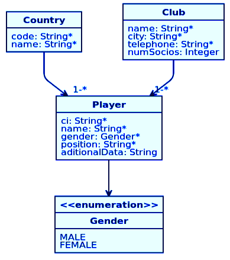
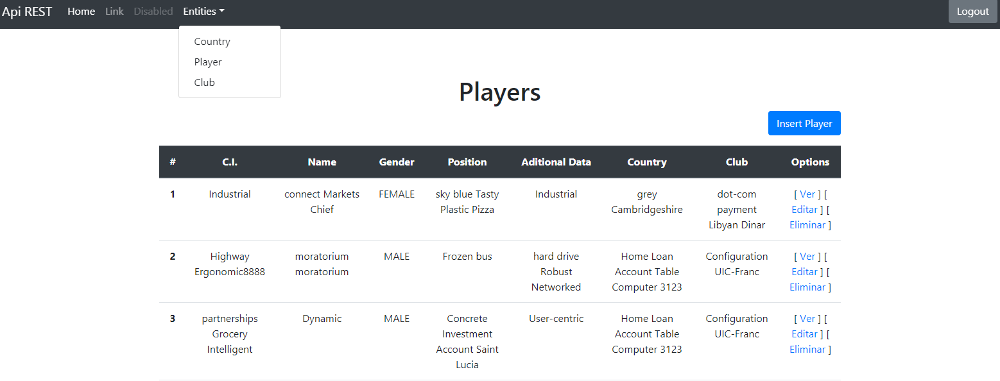

# Cliente REST API Java Hipster, utilizando PHP y Guzzle

Autor: Navarro Arias, Luis Fernando Numa.  
Modulo: Consumo de APIs.  
Universidad Andina Simón Bolivar.  
Sede Sucre, Bolivia.

## Descripción.

Cliente que consume los servicios _REST_ para manejar jugadores de clubes (player) del proyecto [TareaClienteRestGuzzle](https://github.com/lfnna1977/TareaClienteRestGuzzle.git)

## Base de datos.
El cliente trabaja sobre una base de datos que consume desde una api. 

Tablas:  
- Country.  
- Club.  
- Player.  

## Herramientas utilizadas.

Sistema operativo: Debian 10 con Gnome  
IDE: Eclipse v4.12.0  
Servidor REST: [jHipster](https://www.jhipster.tech/). v6.1.2
Navegador web: Firefox 60.8.0esr  
Lenguaje de desarrollo: PHP v7.3

## Para utilizar el cliente.

Se debe de utilizar un servidor Apache con PHP con Composer, en la carpeta /var/www/html colocar el contenido y darle al comando:

composer install

para regenerar las librerias registradas en el composer.json, en este caso la de Guzzle

La URL de acceso al cliente es: [http://localhost/cliente-rest](http://localhost/cliente-rest)
La del servidor [http://uasb-api.rootcode.com.bo/lnavarro/cliente-rest/](http://uasb-api.rootcode.com.bo/lnavarro/cliente-rest/)

Los usuarios disponibles son:
* Usuario: admin, contraseña: admin
* Usuario: user, contraseña: user

## Servicios para consumir.

Los servicios a consumir por el cliente estan el menú Entities: Country, Player y Club, se ha echo lo mas simple posible.

## Configuracion

Si se desea cambiar la url de donde se esta alojado, modificar el archivo

config.inc.php

